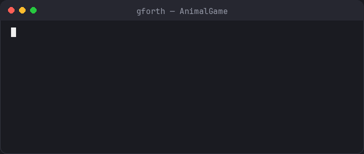
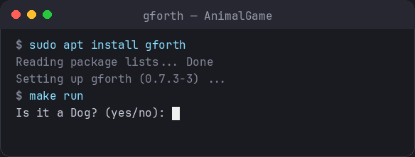

# Animal Game

[](https://github.com/raulkivi/AnimalGame/actions/workflows/test.yml)
[](LICENSE)
[](https://gforth.org/)

A classic "20 questions" style guessing game written in **Forth** (gforth). The
computer tries to guess the animal you're thinking of by asking yes/no
questions. When it guesses wrong, you teach it a new animal and a question that
tells the two apart — so the program gets smarter every time you play. The
learned decision tree is saved to disk and reloaded on the next run.



<details>
<summary>Text transcript of the session above</summary>

```
Is it a Dog? (yes/no): n
I give up!  What animal were you thinking of?
Animal name: Cat
Give me a yes/no question that tells the new animal from my guess:
Question: Does it meow?
For the new animal, is the answer to your question YES? (yes/no): y
Would you like to play again? (yes/no): n
```

</details>

## Contents

- [Requirements](#requirements)
- [Running](#running)
- [How it works](#how-it-works)
- [Documentation](#documentation)
- [Tests](#tests)
- [A bit about Forth](#a-bit-about-forth)
- [License](#license)

## Requirements

- [gforth](https://gforth.org/) (tested with 0.7.3, the last numbered stable
  release, from 2014; newer dated development snapshots also work)

```bash
# Debian/Ubuntu
sudo apt install gforth
```

## Running

Run all commands **from the project root** — `REQUIRE` resolves paths relative
to the gforth process's working directory.



```bash
make run     # play the game
make test    # run all unit test suites
make clean   # delete the saved tree (data/tree.dat)
```

Individual test suites:

```bash
make test-node
make test-ui
make test-tree
make test-persist
```

## How it works

The game is a binary decision tree:

- **Leaf (animal) nodes** hold an animal name — the program's guess.
- **Internal (question) nodes** hold a yes/no question with a `yes` child and a
  `no` child.

Play walks from the root, following the `yes`/`no` branch of each question until it reaches a leaf, then guesses that animal. A wrong guess triggers **learning**: the leaf is replaced in place by a new question node whose two children are the old animal and the newly taught one. The updated tree is saved to `data/tree.dat` after every round and reloaded on the next launch (a one-leaf seed tree is used on first run).

## Documentation

The full design specification and Forth implementation reference — data
structure, game loop, learning algorithm, module layout and word-level API, and
the persistence format — live in [`docs/AnimalGame.md`](docs/AnimalGame.md).

## Tests

Unit tests use a lightweight `{ ... }` assertion harness and override the `ui.fs`
`DEFER` words with scripted answers, so the game logic is exercised without any
real terminal input. All four suites pass:

```bash
$ make test
test-node.fs: all tests passed
test-ui.fs: all tests passed
test-tree.fs: all tests passed
test-persist.fs: all tests passed
```

## A bit about Forth

[Forth](https://en.wikipedia.org/wiki/Forth_(programming_language)) was created
by **Charles "Chuck" Moore** over roughly 1968–1971. He developed the early
ideas at Mohasco Industries and then, in 1971, built the first complete
standalone Forth at the U.S. **National Radio Astronomy Observatory (NRAO)** to
control the 11‑metre radio telescope at Kitt Peak — the application that made
the language famous.[^moore-hopl] It is a stack-based, extensible
language: you build a program by defining new "words" in terms of existing ones,
growing the language upward until it speaks your problem domain directly. The
whole system — compiler, interpreter, and live REPL — is tiny, which made Forth a
natural fit for the small, resource-constrained computers of its era.

**Forth and AI (late 1970s–1980s, the expert-systems era).** During the expert-systems boom of the 1980s, its interactivity and radical extensibility made it an appealing niche vehicle for AI experimentation and robotics. Because a Forth programmer effectively *grows a domain-specific language* (the same trait that drew people to Lisp, but in a tiny footprint suited to embedded control), hobbyists and researchers built small expert-system shells, rule engines, and real-time control for autonomous robots in Forth. After the late-1980s "AI winter" that interest faded along with the wider field. This little game is a miniature example of that tradition: a program that starts almost knowing nothing and extends its own decision tree from experience.

**Forth in the space industry.** Forth's tiny footprint, deterministic real-time behaviour, and live, on-target interactivity (you can poke at a running system over a slow telemetry link) made it a favourite for spacecraft and embedded avionics. Moore pioneered **stack processors that execute Forth in hardware** (his Novix NC4016); that lineage led to chips such as the Harris/Intersil **RTX2010**, which flew on numerous missions — including the **Philae** lander of ESA's Rosetta comet mission, where two RTX2010s ran the command-and-data management system.[^rtx-philae] From the 1980s and 1990s onward, Forth has been used in instruments and controllers across NASA and ESA programs (Galileo, Cassini, NEAR, and others), where small, reliable, and inspectable code matters most.[^forth-space]

**Forth's influence: PostScript/Ghostscript and the Java VM.** Forth's core
idea — express computation as words operating on an operand **stack**, run by a
small, portable virtual machine — rippled out far beyond Forth itself.

- **PostScript and Ghostscript.** Adobe's **PostScript** page-description
  language is, at heart, a stack-based, postfix (reverse-Polish) interpreter very much in the Forth-like tradition: you push operands and then apply operators, and you extend the language by defining new procedures in terms of existing ones. John Warnock and Chuck Geschke drew on that stack-based model — by way of their earlier Interpress and "Design System" work — when they founded Adobe in 1982 and shipped PostScript in 1984.[^postscript] (Its genealogy runs through that Design System / Interpress line rather than directly from Forth, but the two share the same stack-and-postfix spirit.)
  **[Ghostscript](https://www.ghostscript.com/)**, first released by L. Peter
  Deutsch in 1988, is the long-lived open-source interpreter for PostScript and
  PDF — so every time Ghostscript renders a `.ps` file, it is executing a stack
  language in that same lineage.[^ghostscript]

- **Java and the JVM.** Java compiles to **bytecode** that runs on the **Java
  Virtual Machine**, and the JVM is itself a *stack machine*: instructions like
  `iload`, `iadd`, and `invokevirtual` push and pop values on an operand stack
  rather than naming registers.[^jvm-spec] Stack machines actually predate Forth (the Burroughs B5000 dates to 1961), but Forth popularized the "compile to a compact, portable, stack-based bytecode run by a tiny VM" approach in software, and its threaded code and inner interpreter are close cousins of later bytecode VMs.[^threaded] The JVM didn't copy Forth directly — it's convergent design — but it shares the same stack-VM philosophy.

The through-line: Forth showed that a stack-oriented virtual machine can be
small, portable, and easy to implement — a lesson that PostScript adopted almost literally and that the JVM (and CPython, WebAssembly, and others) carried into the mainstream.

## License

[MIT](LICENSE)

## Sources & further reading

[^moore-hopl]: Charles H. Moore, *The Evolution of FORTH* (ACM HOPL II) —
    [colorforth.github.io/HOPL.html](https://colorforth.github.io/HOPL.html);
    *Forth (programming language)* —
    [en.wikipedia.org/wiki/Forth\_(programming\_language)](https://en.wikipedia.org/wiki/Forth_(programming_language)).
[^rtx-philae]: *RTX2010* —
    [en.wikipedia.org/wiki/RTX2010](https://en.wikipedia.org/wiki/RTX2010);
    "Here Comes Philae — Powered by an RTX2010", CPU Shack —
    [cpushack.com/2014/11/12/here-comes-philae-powered-by-an-rtx2010](https://www.cpushack.com/2014/11/12/here-comes-philae-powered-by-an-rtx2010/).
[^forth-space]: "Space Applications", Forth, Inc. —
    [forth.com/resources/space-applications](https://www.forth.com/resources/space-applications/).
[^postscript]: *PostScript* —
    [en.wikipedia.org/wiki/PostScript](https://en.wikipedia.org/wiki/PostScript)
    (Adobe founded 1982; PostScript released 1984).
[^ghostscript]: *Ghostscript* —
    [en.wikipedia.org/wiki/Ghostscript](https://en.wikipedia.org/wiki/Ghostscript)
    (first released by L. Peter Deutsch, 1988).
[^jvm-spec]: *The Java Virtual Machine Specification*, §2.6 (Frames / operand
    stack) —
    [docs.oracle.com/javase/specs/jvms/se22/html/jvms-2.html](https://docs.oracle.com/javase/specs/jvms/se22/html/jvms-2.html).
[^threaded]: *Stack machine* —
    [en.wikipedia.org/wiki/Stack\_machine](https://en.wikipedia.org/wiki/Stack_machine);
    *Threaded code* —
    [en.wikipedia.org/wiki/Threaded\_code](https://en.wikipedia.org/wiki/Threaded_code).
