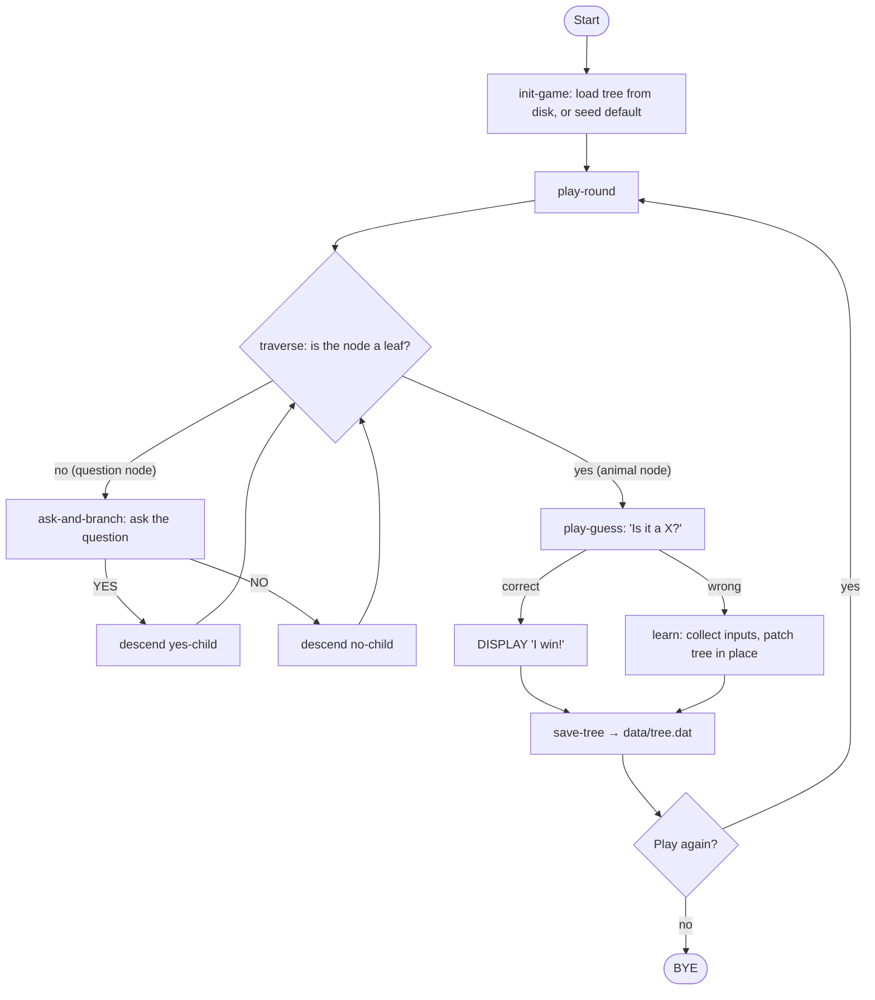
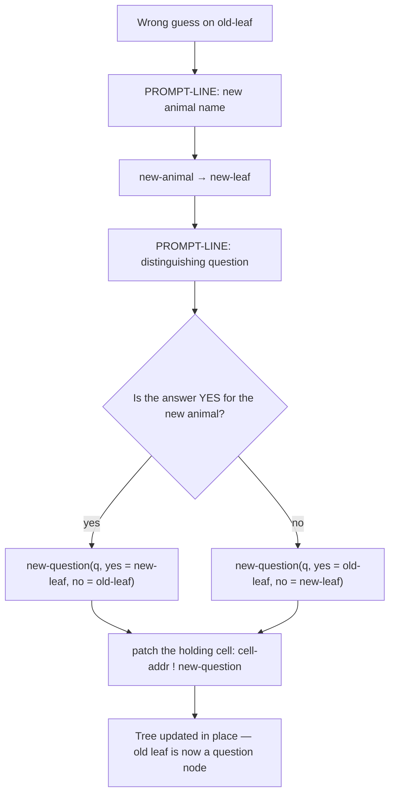
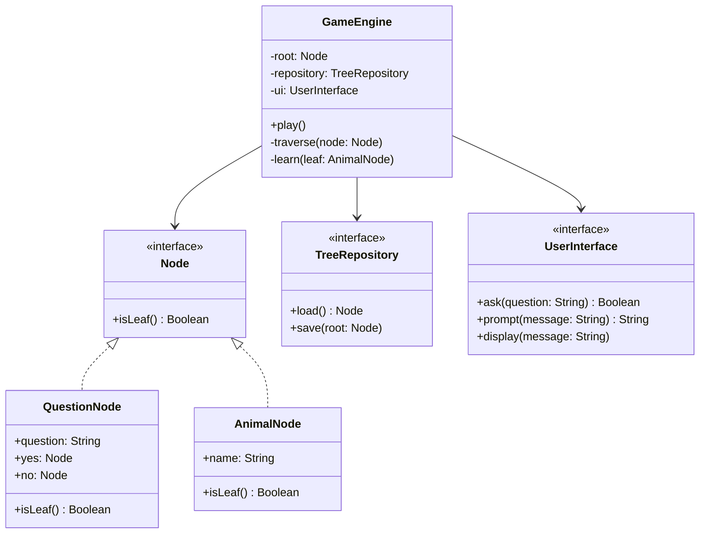
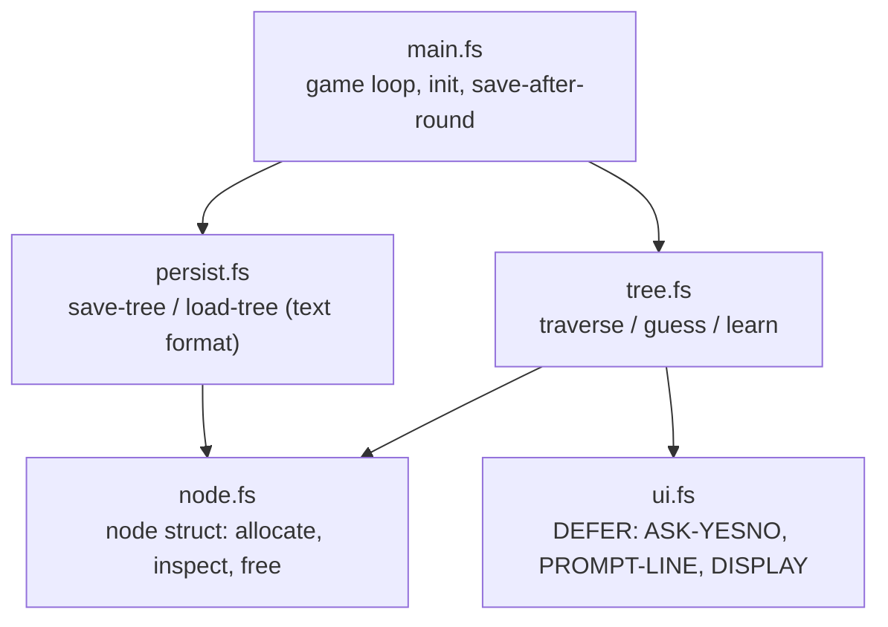
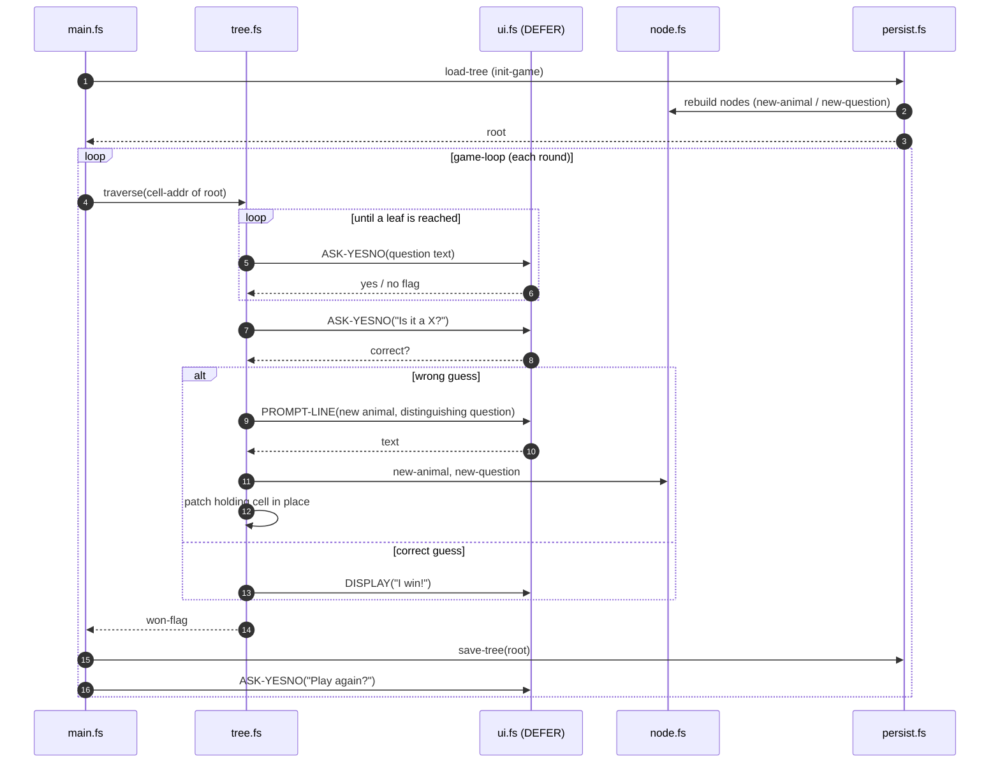

# Animal Game

**"Animal Game"** or **"Animal Guessing Game"** — a self-learning guessing game backed by a binary decision tree that grows through gameplay.

---

## Table of Contents

1. [Overview](#overview)
2. [Core Concept](#core-concept)
3. [Data Structure](#data-structure)
4. [Game Loop](#game-loop)
5. [Learning Algorithm](#learning-algorithm)
6. [Persistence](#persistence)
7. [Project Structure](#project-structure)
8. [Domain Model](#domain-model)
9. [User Interactions](#user-interactions)
10. [Acceptance Criteria](#acceptance-criteria)
11. [Constraints & Non-Functional Requirements](#constraints--non-functional-requirements)

---

## Overview

When implemented as a program, it is a classic demonstration of a **Binary Decision Tree**. The game starts knowing nothing (or just one animal) and learns new animals from the player every time it guesses wrong. Over many sessions it grows into a rich knowledge base built entirely from human input.

---

## Core Concept

The game starts with a single question (e.g., *"Is it a mammal?"*). Every **Yes** or **No** answer leads to either another question node or a terminal guess (a *leaf node*).

The cool part is how it **learns**:

| Scenario | What happens |
|---|---|
| Game guesses correctly | "I win!" — round ends |
| Game guesses wrong (e.g., guesses *Dog*, player thought *Wolf*) | Game asks for a distinguishing question |
| Player provides question (e.g., *"Does it live in the wild?"*) | The old leaf (*Dog*) is replaced with a new question node; *Wolf* goes under **Yes**, *Dog* under **No** |

Over time, a completely blank program grows into a massive database of animal knowledge just by playing with humans.

---

## Data Structure

The knowledge base is a **binary tree** where every node is one of two types:

```
Node
 ├── QuestionNode   text: String   yes: Node   no: Node
 └── AnimalNode     name: String   (leaf)
```

### Example Tree

```
Is it a mammal?
├── YES → Does it live in the wild?
│         ├── YES → Wolf
│         └── NO  → Dog
└── NO  → Does it have feathers?
          ├── YES → Parrot
          └── NO  → Lizard
```

### Node Contract

```
interface Node {
  isLeaf(): Boolean
}

class QuestionNode implements Node {
  question: String   // ends with "?"
  yes: Node
  no:  Node
}

class AnimalNode implements Node {
  name: String       // e.g. "Wolf"
}
```

---

## Game Loop



---

## Learning Algorithm

Triggered when the game guesses wrong.

**Inputs collected from player:**
1. The correct animal name (e.g. *"Wolf"*)
2. A yes/no question that distinguishes the new animal from the guessed one (e.g. *"Does it live in the wild?"*)
3. Whether the answer to that question is YES or NO for the new animal

**Tree mutation:**

```
Before:                     After:
  [Dog]                 [Does it live in the wild?]
                         ├── YES → [Wolf]
                         └── NO  → [Dog]
```

The existing `AnimalNode` is replaced in-place by a new `QuestionNode`. The two children are the new animal and the old guess, assigned to the yes/no branches based on the player's answer.

**Pseudocode:**

```
function learn(leafNode, correctAnimal, question, newAnimalIsYes):
    newQuestion = QuestionNode(question)
    newLeaf     = AnimalNode(correctAnimal)
    if newAnimalIsYes:
        newQuestion.yes = newLeaf
        newQuestion.no  = leafNode
    else:
        newQuestion.yes = leafNode
        newQuestion.no  = newLeaf
    replace leafNode with newQuestion in parent
```

**Control flow:**



---

## Persistence

The tree must survive between sessions. This implementation uses a compact,
human-readable **pre-order text format** — one node per line:

```
Q Does it meow?
A Cat
A Dog
```

- `Q <text>` — a question node; the next two sub-trees (read in pre-order) become
  its yes-child and no-child, respectively.
- `A <name>` — an animal (leaf) node.

The format is trivial to inspect, diff, and hand-edit.

**Operations required:**
- `load(path) → Node` — deserialize the tree from file; create the default seed
  tree if the file is absent or empty.
- `save(root, path)` — serialize and write atomically (write to `<path>.tmp`,
  then rename onto `<path>`).

The words that implement this live in [`persist.fs`](#forth-implementation).

---

## Project Structure

```
AnimalGame/
├── src/
│   ├── node.fs        # node structure: allocate, inspect, free
│   ├── ui.fs          # abstract I/O layer (DEFER words + defaults)
│   ├── tree.fs        # traversal and learning
│   ├── persist.fs     # save / load the decision tree
│   └── main.fs        # entry point and game loop
├── tests/
│   ├── test-node.fs
│   ├── test-tree.fs
│   └── test-persist.fs
├── data/              # persisted knowledge base (tree.dat, created at runtime)
├── docs/
│   └── AnimalGame.md
├── Makefile
└── README.md
```

---

## Domain Model



---

## Forth Implementation

This repository realizes the design above in **Forth (gforth)**. The abstract
domain model maps onto five source modules:

| Spec concept                          | Forth module        |
|---------------------------------------|---------------------|
| `Node`, `QuestionNode`, `AnimalNode`  | `src/node.fs`       |
| `UserInterface`                       | `src/ui.fs` (DEFER words) |
| `GameEngine` traversal + learning     | `src/tree.fs`       |
| `TreeRepository`                      | `src/persist.fs`    |
| entry point / game loop               | `src/main.fs`       |

### Module dependencies



### Runtime flow (one round)

How the words interact at runtime, from loading the tree through a wrong guess
that triggers learning and a final save:



### Public words

**`node.fs`** — a node is a heap block of five cells (`NODE-TYPE`, `NODE-TEXT`,
`NODE-TLEN`, `NODE-YES`, `NODE-NO`):
- `new-animal ( c-addr u -- node )` — leaf node with a heap-copied name
- `new-question ( c-addr u yes no -- node )` — internal node
- `node-leaf? ( node -- flag )`
- `free-node ( node -- )` — frees string + node block (non-recursive)

**`ui.fs`** — all user I/O via three `DEFER` words, with `ACCEPT`/`TYPE`-backed
defaults; tests override them with scripted answers:
- `ASK-YESNO ( c-addr u -- flag )` — the default re-prompts until the answer is a
  valid yes/no
- `PROMPT-LINE ( c-addr u -- c-addr2 u2 )`
- `DISPLAY ( c-addr u -- )`
- `classify-yn ( c-addr u -- yes-flag valid-flag )` — input classifier used by the
  default `ASK-YESNO`; first non-blank char `y`/`n` (case-insensitive), else invalid

**`tree.fs`** — traversal and learning:
- `traverse ( cell-addr -- won-flag )` — recursive DFS over the *address of the
  cell* holding the current node
- `ask-and-branch ( node -- yes-flag )`
- `play-guess ( cell-addr node -- won-flag )`
- `learn ( cell-addr old-leaf -- )` — builds the new question node and patches the
  cell in place

**`persist.fs`** — text-format save/load (see [Persistence](#persistence)); both
are `DEFER` words (a swappable *TreeRepository* interface) bound to file-backed
defaults `file-save-tree` / `file-load-tree`:
- `save-tree ( root c-addr u -- )` — atomic (write `.tmp`, then rename)
- `load-tree ( c-addr u -- root )` — falls back to `default-tree` on a missing,
  empty, **or corrupt** file (the parse runs under `CATCH`; malformed input
  raises `CORRUPT-TREE`)

**`main.fs`** — `init-game`, `play-round`, `game-loop`, `run-game` (the file ends
with `run-game BYE`); `SAVE-PATH` = `data/tree.dat`.

### Key design decisions

- **DEFER-based interfaces.** Both the UI (`ui.fs`) and the repository
  (`persist.fs` `save-tree`/`load-tree`) are `DEFER` words, so tests swap in
  scripted answers and fake repositories — exercising all game logic without a
  terminal or the filesystem.
- **Graceful degradation.** Invalid yes/no input re-prompts; a missing, empty, or
  corrupt save file falls back to the default seed tree instead of crashing.
- **Cell-address traversal.** `traverse` receives the *address of the cell* that
  holds the current node (not the node), so `learn` patches the parent pointer
  with a single `!` — no parent back-pointers needed.
- **Plain-text persistence.** The pre-order `Q`/`A` format is human-readable and
  trivially parsed.

### Implementation notes (Forth gotchas)

Forth's explicit data stack makes a few mistakes easy; these bit the original
build and are worth remembering:

- **Stack discipline around `?DO`.** Inside `0 ?DO … LOOP` the loop count has
  already been consumed, so only the buffer address remains. Reaching "below" it
  with `OVER` instead of `DUP` reads unrelated stack data — a stack underflow in
  isolation, an invalid-address crash in the live game.
- **Buffer aliasing.** A `PROMPT-LINE` result is valid only until the next
  `PROMPT-LINE` call, so the default `ASK-YESNO` must read into its *own* buffer
  (`ui-yn-buf`) — otherwise its `ACCEPT` overwrites a question string still in use
  by `learn`.
- **`READ-LINE` returns `( u2 flag )`.** Store the *flag* as the EOF marker and
  keep `u2` (the byte count) as the text length; swapping them yields a negative
  length and a runaway `ALLOCATE`.
- **Numeric base is global.** The test harness (`tester.fs`) switches to `HEX`,
  so a file compiled afterward reads `32` as `0x32 = 50`. Each source file
  declares `DECIMAL` up front so its literals mean what they say regardless of the
  caller's `BASE`.
- **`>R … R>` only inside a definition.** At the top-level interpreter the return
  stack is in use between words, so a value parked with `>R` across interpreted
  lines is clobbered (invalid-address crash). Keep `>R … R>` within a single
  colon definition.

---

## User Interactions

### Traversal prompt

```
Does it have four legs? (yes/no): _
```

### Guess prompt

```
Is it a Dog? (yes/no): _
```

### Learning prompts (on wrong guess)

```
I give up! What animal were you thinking of? _
Please enter a yes/no question that distinguishes a <new animal> from a <guessed animal>: _
For a <new animal>, is the answer to that question yes or no? (yes/no): _
```

### Play again

```
Would you like to play again? (yes/no): _
```

---

## Acceptance Criteria

- [x] Game starts from a single default animal if no save file exists
- [x] Game correctly traverses the tree and guesses based on player answers
- [x] On a correct guess, the game announces its win and offers another round
- [x] On a wrong guess, the game collects the three learning inputs and updates the tree
- [x] The updated tree is saved to disk after every round
- [x] On next launch the tree reflects all previously learned animals
- [x] Invalid input (anything other than yes/no) is re-prompted until valid
- [x] The game handles an empty or corrupt save file gracefully (falls back to default)
- [x] All core logic (traversal, learning, tree mutation) is covered by unit tests
- [x] `UserInterface` and `TreeRepository` are interfaces so the game engine is testable without I/O

---

## Constraints & Non-Functional Requirements

| Concern | Requirement |
|---|---|
| **Architecture** | `GameEngine` must not depend on concrete I/O classes — depend on abstractions (`UserInterface`, `TreeRepository`) |
| **TDD** | All domain and engine logic written test-first |
| **SOLID** | Single-responsibility per class; open for extension (new UI adapters, storage backends) without modifying engine |
| **No frameworks** | Core logic must be pure domain code with zero framework dependencies |
| **Question format** | All question nodes must end with `"?"` — validated on input |
| **Performance** | Tree traversal is O(depth); depth is unbounded but typical sessions stay under 30 nodes |
| **Encoding** | Save file is UTF-8 text (line-based `Q`/`A` format); animal names and questions support Unicode |
